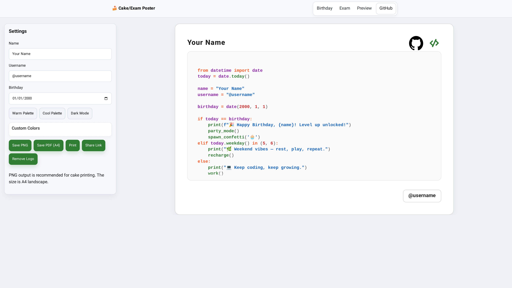

<!-- Language Switcher -->
<p align="center" dir="rtl">
  <b>🌐 این صفحه:</b> فارسی &nbsp;|&nbsp;
  <a href="./README.md"><b>English</b></a>
</p>

<h1 align="center" dir="rtl">🎂 سازندهٔ پوستر کیک/امتحان</h1>

<p align="center">
  <a href="https://power0matin.github.io/birthday-cake-generator/">
    
  </a>
</p>

<p align="center" dir="rtl">
  <a href="https://img.shields.io/badge/pages-live-6f48ff?logo=github&logoColor=white"></a>
  <a href="LICENSE"></a>
  <a href="./CHANGELOG.md"></a>
  
  
  
  
</p>

<p align="center" dir="rtl">
  <a href="https://www.javascript.com/"></a>
  
  
</p>

ابزاری رایگان، آفلاین و بدون بیلد برای ساخت **پوسترهای آمادهٔ چاپ A4 افقی** با ظاهر کدنویسی—مناسب برای **چاپ روی کیک تولد**، **پوستر انگیزشی امتحان**، هدیه و رویدادهای برنامه‌نویسی.

<p align="center" dir="rtl">
  <a href="https://power0matin.github.io/birthday-cake-generator/"><b>🎉 نسخهٔ تولد (دمو)</b></a> ·
  <a href="https://power0matin.github.io/birthday-cake-generator/school.html"><b>📚 نسخهٔ امتحان (دمو)</b></a>
</p>

## ✨ ویژگی‌ها

- 🎨 قابل‌سفارشی‌سازی: **نام**، **نام‌کاربری**، **تاریخ** (تولد/امتحان)، **رنگ‌ها**
- 🖼️ **لوگو/آواتار** با **کلیک** یا **کشیدن‌و‌رهاکردن** + حذف
- 🧩 **مخفی‌سازی لوگو در خروجی/چاپ** (سوییچ مدرن)
- 🌈 پرست‌های آماده + انتخاب‌گرهای کامل رنگ
- 💾 **ذخیره/بارگذاری** تم (localStorage)، **اِکسپورت/ایمپورت** تم (JSON)
- 🔗 **لینک قابل اشتراک** (همگام‌سازی خودکار در URL)
- 📤 خروجی **PNG** (کیفیت بالا) / **PDF (A4)** · 🖨️ چاپ
- ⚡ بدون فریم‌ورک/بیلد — فقط **HTML/CSS/JS**
- 📴 کاملاً **آفلاین**

## 🗂️ ساختار پروژه

```
.
├─ index.html          # پوستر تولد
├─ school.html         # پوستر امتحان
├─ style.css           # استایل UI + چاپ/اکسپورت
├─ main.js             # منطق برنامه
└─ assets/
   └─ birthday-cake-preview.png
```

## 🚀 شروع سریع

```bash
git clone https://github.com/power0matin/birthday-cake-generator.git
cd birthday-cake-generator
# فایل‌ها را مستقیماً باز کن:
# - index.html (تولد)
# - school.html (امتحان)
```

(اختیاری) با یک سرور سبک:

```bash
python -m http.server 8080
# باز کن: http://localhost:8080
```

## 🧭 راهنما

1. در پنل **Settings**: نام/نام‌کاربری/تاریخ را وارد کن.
2. از **Warm/Cool/Dark** یا رنگ‌های سفارشی استفاده کن.
3. **لوگو/آواتار**: کلیک یا درگ‌اَند‌دراپ.
   - با سوییچ **Hide on export/print** نمایش در خروجی را کنترل کن.
   - با **Remove Logo** حذف کن.
4. **Share Link** را بزن (URL خودکار به‌روزرسانی می‌شود).
5. خروجی: **PNG**، **PDF (A4)**، یا **Print**.

## ⚙️ پیکربندی صفحه

هر صفحه مقادیر پیش‌فرض را از `data-*` روی `#sheet` می‌خواند:

```html
<section
  id="sheet"
  class="sheet"
  aria-label="A4 Cake Poster"
  data-date-label="Birthday"
  data-default-name="Your Name"
  data-default-username="@username"
  data-default-date="2000-01-01"
  data-filename-prefix="cake-poster"
  data-theme-key="cake_poster_theme_v1"
></section>
```

## 🔗 URL قابل اشتراک

پارامترهای همگام‌شده:

```
n, u, d, bg, ink, kw, mod, func, str, num, border, codebg, punct
```

با همین لینک، تنظیمات دوباره بارگذاری می‌شوند.

## 🎛️ تم (JSON)

```json
{
  "bg": "#ffffff",
  "ink": "#222222",
  "kw": "#ff5722",
  "mod": "#8e24aa",
  "func": "#2e7d32",
  "str": "#1565c0",
  "num": "#d32f2f",
  "border": "#e0e0e0",
  "codebg": "#fafafa",
  "punct": "#444444"
}
```

## 🧩 نکات فنی

- **اکسپورت**: `html-to-image` (PNG)، `jsPDF` (PDF A4 افقی)
- **چاپ**: قوانین `@page`؛ مخفی‌کردن پنل؛ حاشیهٔ امن
- **تایپوگرافی**: JetBrains Mono
- **پایداری**: بررسی بارگذاری کتابخانه‌ها، آزادسازی ObjectURL، همگام‌سازی قبل از چاپ

## ♿ دسترس‌پذیری

- کنترل‌های برچسب‌دار، سوییچ قابل فوکوس با کیبورد
- کنتراست رنگ با تم تعیین می‌شود (در صورت نیاز پرست high-contrast اضافه کنید)

## 🤝 مشارکت

پول‌ریکوئست‌ها خوش‌آمدند! از الگوی **Conventional Commits** استفاده کنید:

```
feat: add new preset
fix: correct print margins in Firefox
docs: update README with URL params
```

## 🧭 نقشهٔ راه

- پرست‌های بیشتر (Pastel/Neon/Solarized)
- انتخاب گرد/گوشه‌گرد برای آواتار
- کاونت‌داون بزرگ در حالت Exam
- PWA (افزودن به صفحهٔ اصلی)

## 📜 مجوز

**MIT** — آزاد برای استفاده و تغییر.

## 📬 ارتباط با من

**Matin Shahabadi (متین شاه‌آبادی / متین شاه آبادی)**

 وب‌سایت: [matinshahabadi.ir](https://matinshahabadi.ir)
* ایمیل: [me@matinshahabadi.ir](mailto:me@matinshahabadi.ir)
* گیت‌هاب: [power0matin](https://github.com/power0matin)
* لینکدین: [matin-shahabadi](https://www.linkedin.com/in/matin-shahabadi)

## 🧾 تغییرات

برای یادداشت نسخه‌ها، **[CHANGELOG.md](./CHANGELOG.md)** را ببینید (Keep a Changelog + SemVer).
